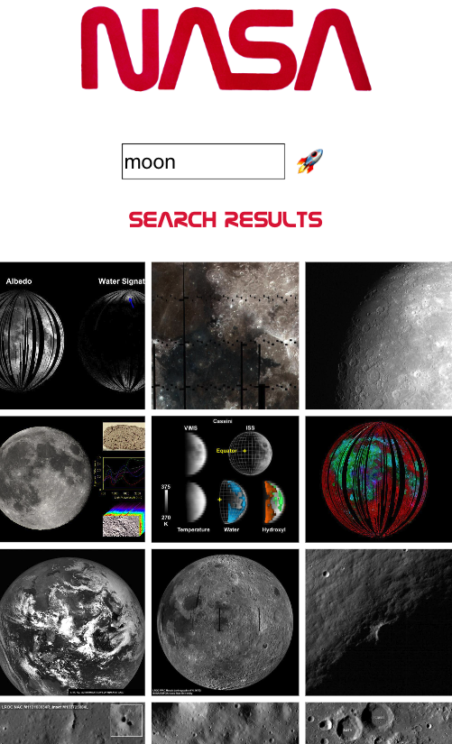
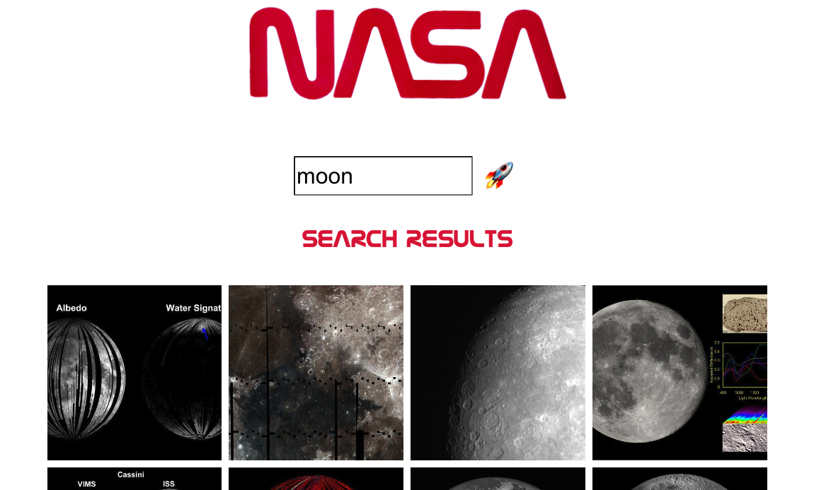

# Command Shift NASA Images 'Tech-Test"

This project is a technical test similar to what may be given when applying for a junior software developer role. The test is intended to familiarise the student with the scope and timescale of such a test.

## Technical Task Description 

To design, build and test a search page in the browser which allows users to search for NASA images by a keyword utilising the NASA image API.

**Brief:**
* Build a React web application that allows users to search for images based on a query relating to space.
* Images must be returned upon a successful search.
* The styling is left to the designer but will be taken into consideration when evaluating the application.

## Screenshots

**Mobile Version**

**Desktop Version**

## Built with

This application was built using the [React](https://reactjs.org/) library with a functional component based approach.

## Testing Libraries

I used a Test Driven Development (TDD) approach when it came to testing the application, first building the component and implementing the required features, and then testing against the requirements to ensure the application met the criteria of the brief.

**Testing libraries include:**

* [Jest](https://jestjs.io/)
* [React Testing Library](https://testing-library.com/)

## Packages Used

In addition to the testing libraries mentioned above:

* ESLint - used to follow industry standard rules with some slight configurations.
* Prettier - used to ensure consistency in code formatting.
* Prop Types - used to type check this React application and catch errors before runtime.
* Axios - used to make requests to the NASA API endpoint.

## Installation Instructions

* Clone this repo
  * e.g. `gitclone https://github.com/tonymm55/tech-test.git`
* Change directory into the repo
  * e.g. `cd tech-test` (or the directory you specified the repo to be cloned into)
* Install the dependencies from `package-lock.json`
  * `npm install`
* To start the app:
  * `npm start`

Runs the app in the development mode.\
Open [http://localhost:3000](http://localhost:3000) to view it in your browser.

The page will reload when you make changes.\
You may also see any lint errors in the console.

* To test the app:
  * `npm test`

Launches the test runner in the interactive watch mode.\
See the section about [running tests](https://facebook.github.io/create-react-app/docs/running-tests) for more information.

## If I Had More Time

I would like to implement:

* Add more functionality to the site to include advanced search features for improved search results. The search results are rudimentary currently and I'd like to investigate what the search results are based on.
* Write more comprehensive tests to ensure the application is robust, stable and feature tested.
* Add some UI helpers such as providing the user with some tags that they can click to search common terms.

## Author

This project was authored by Anthony Moran. I can be contacted at [LinkedIn](linkedin.com/in/anthonymmoran) and [Twitter](https://twitter.com/TonyMCodes).
